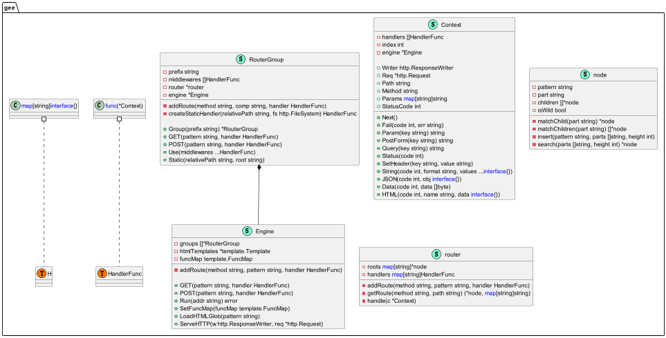

# Gee 框架
## 开发环境
- 操作系统: Ubuntu20.04TLS
- Go版本:  go1.21.4
- IDE:    GoLand
## UML类图

## 代码统计
```shell
$ git ls-files | grep -v -E "$(cat .gitignore | grep -v '^#' | grep -v '^$' | sed -e 's/^[ \t]*//;s/[ \t]*$//')" | xargs wc -l

   99 gee/context.go
  143 gee/gee.go
    3 gee/go.mod
   17 gee/logger.go
   40 gee/recovery.go
   85 gee/router.go
   51 gee/router_test.go
   66 gee/trie.go
    7 go.mod
   54 main.go
  567 total
```
